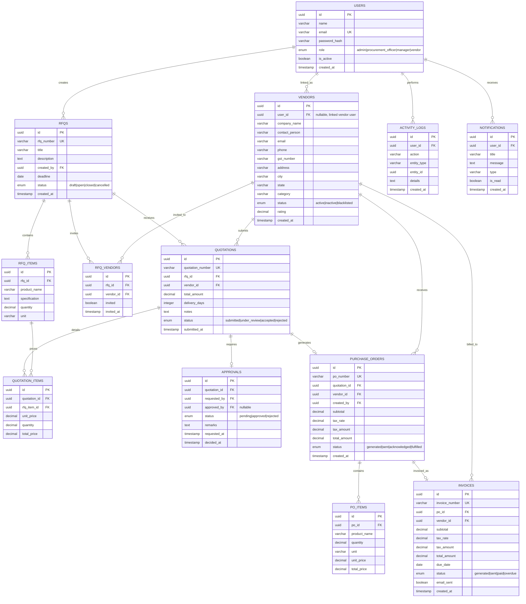

# VendorBridge — Procurement & Vendor Management ERP

## Implementation Plan

A full-stack ERP platform for managing vendors, RFQs, quotations, approvals, purchase orders, invoices, and procurement analytics.

---

## Tech Stack

| Layer | Technology |
|---|---|
| **Frontend** | Next.js 14 (App Router), Vanilla CSS (design system) |
| **Backend** | Node.js + Express.js (REST API) |
| **Database** | PostgreSQL (via `pg` + raw SQL / Knex.js for query builder & migrations) |
| **Auth** | JWT (access + refresh tokens), bcrypt for password hashing |
| **PDF Generation** | Server-side with **Puppeteer** (HTML → PDF, pixel-perfect invoices) |
| **Email** | Nodemailer with Gmail SMTP |
| **State Management** | React Context + SWR for data fetching |
| **Charts** | Recharts (lightweight, composable) |

---

## Project Structure

```
Odoo-Hackathon/
├── backend/
│   ├── package.json
│   ├── server.js                    # Express entry point
│   ├── config/
│   │   ├── db.js                    # PostgreSQL connection pool
│   │   └── env.js                   # Environment config
│   ├── middleware/
│   │   ├── auth.js                  # JWT verification
│   │   ├── rbac.js                  # Role-based access control
│   │   ├── validate.js              # Request validation
│   │   └── errorHandler.js          # Global error handler
│   ├── routes/
│   │   ├── auth.routes.js
│   │   ├── vendor.routes.js
│   │   ├── rfq.routes.js
│   │   ├── quotation.routes.js
│   │   ├── approval.routes.js
│   │   ├── purchaseOrder.routes.js
│   │   ├── invoice.routes.js
│   │   ├── activity.routes.js
│   │   ├── report.routes.js
│   │   └── user.routes.js
│   ├── controllers/
│   │   ├── auth.controller.js
│   │   ├── vendor.controller.js
│   │   ├── rfq.controller.js
│   │   ├── quotation.controller.js
│   │   ├── approval.controller.js
│   │   ├── purchaseOrder.controller.js
│   │   ├── invoice.controller.js
│   │   ├── activity.controller.js
│   │   ├── report.controller.js
│   │   └── user.controller.js
│   ├── services/
│   │   ├── email.service.js         # Nodemailer integration
│   │   ├── pdf.service.js           # Puppeteer PDF generation
│   │   └── notification.service.js  # In-app notifications
│   ├── migrations/
│   │   └── 001_initial_schema.sql
│   ├── seeds/
│   │   └── seed.sql                 # Demo data
│   └── templates/
│       └── invoice.html             # HTML invoice template for PDF
│
├── frontend/
│   ├── package.json
│   ├── next.config.js
│   ├── app/
│   │   ├── layout.js                # Root layout with sidebar
│   │   ├── page.js                  # Redirect to /dashboard
│   │   ├── globals.css              # Design system & tokens
│   │   ├── login/page.js
│   │   ├── signup/page.js
│   │   ├── forgot-password/page.js
│   │   ├── dashboard/page.js
│   │   ├── vendors/
│   │   │   ├── page.js              # Vendor list
│   │   │   ├── [id]/page.js         # Vendor detail
│   │   │   └── new/page.js          # Add vendor
│   │   ├── rfqs/
│   │   │   ├── page.js              # RFQ list
│   │   │   ├── [id]/page.js         # RFQ detail + quotations
│   │   │   └── new/page.js          # Create RFQ
│   │   ├── quotations/
│   │   │   ├── page.js              # Quotation list
│   │   │   ├── [id]/page.js         # Quotation detail
│   │   │   ├── compare/page.js      # Side-by-side comparison
│   │   │   └── submit/[rfqId]/page.js # Vendor quotation submission
│   │   ├── approvals/
│   │   │   ├── page.js              # Approval queue
│   │   │   └── [id]/page.js         # Approval detail
│   │   ├── purchase-orders/
│   │   │   ├── page.js              # PO list
│   │   │   └── [id]/page.js         # PO detail + invoice
│   │   ├── invoices/
│   │   │   ├── page.js              # Invoice list
│   │   │   └── [id]/page.js         # Invoice detail/print/email
│   │   ├── activity/page.js         # Activity logs
│   │   ├── reports/page.js          # Analytics & reports
│   │   └── admin/
│   │       ├── users/page.js        # User management
│   │       └── settings/page.js     # System settings
│   ├── components/
│   │   ├── layout/
│   │   │   ├── Sidebar.js
│   │   │   ├── Topbar.js
│   │   │   └── AppShell.js
│   │   ├── ui/
│   │   │   ├── Button.js
│   │   │   ├── Card.js
│   │   │   ├── Modal.js
│   │   │   ├── Table.js
│   │   │   ├── Badge.js
│   │   │   ├── Input.js
│   │   │   ├── Select.js
│   │   │   ├── Textarea.js
│   │   │   ├── Toast.js
│   │   │   ├── Dropdown.js
│   │   │   ├── Tabs.js
│   │   │   ├── Timeline.js
│   │   │   ├── StatusBadge.js
│   │   │   ├── EmptyState.js
│   │   │   └── Loader.js
│   │   ├── charts/
│   │   │   ├── SpendingChart.js
│   │   │   ├── VendorPerfChart.js
│   │   │   └── ProcurementTrend.js
│   │   └── forms/
│   │       ├── VendorForm.js
│   │       ├── RFQForm.js
│   │       ├── QuotationForm.js
│   │       └── ApprovalForm.js
│   ├── context/
│   │   ├── AuthContext.js
│   │   └── ToastContext.js
│   ├── hooks/
│   │   ├── useAuth.js
│   │   ├── useFetch.js
│   │   └── useDebounce.js
│   └── lib/
│       ├── api.js                   # Axios instance with interceptors
│       ├── constants.js
│       └── utils.js                 # Formatters, helpers
```

---

## Database Schema (PostgreSQL)

> [!IMPORTANT]
> All tables use UUIDs as primary keys, have `created_at` / `updated_at` timestamps, and enforce referential integrity via foreign keys.



---

## User Roles & Permissions Matrix

| Permission | Admin | Procurement Officer | Manager/Approver | Vendor |
|---|:---:|:---:|:---:|:---:|
| Manage users | ✅ | ❌ | ❌ | ❌ |
| Manage vendors | ✅ | ✅ | ❌ | ❌ |
| Create RFQs | ✅ | ✅ | ❌ | ❌ |
| View RFQs | ✅ | ✅ | ✅ | ✅ (assigned only) |
| Submit quotations | ❌ | ❌ | ❌ | ✅ |
| Compare quotations | ✅ | ✅ | ✅ | ❌ |
| Approve/reject | ❌ | ❌ | ✅ | ❌ |
| Generate POs | ✅ | ✅ | ❌ | ❌ |
| Generate invoices | ✅ | ✅ | ❌ | ❌ |
| View reports | ✅ | ✅ | ✅ | ❌ |
| View activity logs | ✅ | ✅ | ✅ | ❌ |

---

## Stage-by-Stage Implementation Plan

---

### 🏗️ Stage 1: Project Scaffolding & Foundation (Day 1)

**Goal**: Set up both projects, establish the design system, database, and core infrastructure.

#### Backend
- [NEW] Initialize Node.js project with Express
- [NEW] [server.js](file:///Users/sudhanshukumar/Desktop/Odoo-Hackathon/backend/server.js) — Express server with CORS, JSON parsing, error handling
- [NEW] [config/db.js](file:///Users/sudhanshukumar/Desktop/Odoo-Hackathon/backend/config/db.js) — PostgreSQL connection pool (`pg` library)
- [NEW] [config/env.js](file:///Users/sudhanshukumar/Desktop/Odoo-Hackathon/backend/config/env.js) — Environment variable loader
- [NEW] [migrations/001_initial_schema.sql](file:///Users/sudhanshukumar/Desktop/Odoo-Hackathon/backend/migrations/001_initial_schema.sql) — Full database schema (all 14 tables)
- [NEW] [seeds/seed.sql](file:///Users/sudhanshukumar/Desktop/Odoo-Hackathon/backend/seeds/seed.sql) — Demo data for all roles
- [NEW] [middleware/errorHandler.js](file:///Users/sudhanshukumar/Desktop/Odoo-Hackathon/backend/middleware/errorHandler.js) — Centralized error handling

#### Frontend
- [NEW] Initialize Next.js 14 project (App Router)
- [NEW] [globals.css](file:///Users/sudhanshukumar/Desktop/Odoo-Hackathon/frontend/app/globals.css) — Complete design system:
  - CSS custom properties (colors, spacing, radii, shadows, typography)
  - Dark mode support via `prefers-color-scheme`
  - Premium color palette (deep navy, electric blue, warm accents)
  - Utility classes for layout, spacing, and typography
  - Glassmorphism card styles
  - Smooth transitions and animation keyframes
- [NEW] UI component library: `Button`, `Card`, `Input`, `Badge`, `Modal`, `Table`, `Loader`, `Toast`, `EmptyState`
- [NEW] [layout.js](file:///Users/sudhanshukumar/Desktop/Odoo-Hackathon/frontend/app/layout.js) — Root layout with Google Fonts (Inter)

**Deliverable**: Both servers running, database seeded, design system established, component library ready.

---

### 🔐 Stage 2: Authentication & Authorization (Day 1–2)

**Goal**: Full auth system with JWT, role-based routing, and protected pages.

#### Backend
- [NEW] [controllers/auth.controller.js](file:///Users/sudhanshukumar/Desktop/Odoo-Hackathon/backend/controllers/auth.controller.js)
  - `POST /api/auth/signup` — Register with role selection
  - `POST /api/auth/login` — Login, return access + refresh tokens
  - `POST /api/auth/refresh` — Refresh expired access token
  - `POST /api/auth/forgot-password` — Send reset email
  - `POST /api/auth/reset-password` — Reset with token
  - `GET /api/auth/me` — Get current user profile
- [NEW] [middleware/auth.js](file:///Users/sudhanshukumar/Desktop/Odoo-Hackathon/backend/middleware/auth.js) — JWT verification middleware
- [NEW] [middleware/rbac.js](file:///Users/sudhanshukumar/Desktop/Odoo-Hackathon/backend/middleware/rbac.js) — `authorize('admin', 'procurement_officer')` guard
- [NEW] [middleware/validate.js](file:///Users/sudhanshukumar/Desktop/Odoo-Hackathon/backend/middleware/validate.js) — Joi/Zod request validation

#### Frontend
- [NEW] [context/AuthContext.js](file:///Users/sudhanshukumar/Desktop/Odoo-Hackathon/frontend/context/AuthContext.js) — Auth state, login/logout, token refresh
- [NEW] [lib/api.js](file:///Users/sudhanshukumar/Desktop/Odoo-Hackathon/frontend/lib/api.js) — Axios instance with auth interceptors
- [NEW] [login/page.js](file:///Users/sudhanshukumar/Desktop/Odoo-Hackathon/frontend/app/login/page.js) — Premium login screen with animated background
- [NEW] [signup/page.js](file:///Users/sudhanshukumar/Desktop/Odoo-Hackathon/frontend/app/signup/page.js) — Registration with role selection
- [NEW] [forgot-password/page.js](file:///Users/sudhanshukumar/Desktop/Odoo-Hackathon/frontend/app/forgot-password/page.js) — Password reset flow
- [NEW] [components/layout/AppShell.js](file:///Users/sudhanshukumar/Desktop/Odoo-Hackathon/frontend/components/layout/AppShell.js) — Protected layout wrapper (redirects unauthenticated users)
- [NEW] [components/layout/Sidebar.js](file:///Users/sudhanshukumar/Desktop/Odoo-Hackathon/frontend/components/layout/Sidebar.js) — Role-aware navigation sidebar with icons, collapsible groups
- [NEW] [components/layout/Topbar.js](file:///Users/sudhanshukumar/Desktop/Odoo-Hackathon/frontend/components/layout/Topbar.js) — Search, notifications bell, user avatar dropdown

**Deliverable**: Users can sign up, log in, see role-appropriate navigation. Auth persists via tokens.

---

### 📊 Stage 3: Dashboard & Vendor Management (Day 2–3)

**Goal**: Functional dashboard with live stats and full vendor CRUD.

#### Backend
- [NEW] [controllers/vendor.controller.js](file:///Users/sudhanshukumar/Desktop/Odoo-Hackathon/backend/controllers/vendor.controller.js)
  - `GET /api/vendors` — List with search, filter by category/status, pagination
  - `GET /api/vendors/:id` — Vendor detail with stats
  - `POST /api/vendors` — Register new vendor
  - `PUT /api/vendors/:id` — Update vendor
  - `PATCH /api/vendors/:id/status` — Change status (active/inactive/blacklisted)
  - `DELETE /api/vendors/:id` — Soft delete
- [NEW] Dashboard API endpoints:
  - `GET /api/dashboard/stats` — Counts for RFQs, POs, invoices, pending approvals
  - `GET /api/dashboard/recent-activity` — Last 10 activities
  - `GET /api/dashboard/spending-trend` — Monthly spending data for charts

#### Frontend
- [NEW] [dashboard/page.js](file:///Users/sudhanshukumar/Desktop/Odoo-Hackathon/frontend/app/dashboard/page.js)
  - 4 animated stat cards (pending approvals, active RFQs, recent POs, total vendors)
  - Spending trend chart (Recharts area chart)
  - Recent activity feed (timeline component)
  - Quick action buttons (New RFQ, Add Vendor, View Approvals)
  - Role-specific widgets
- [NEW] [vendors/page.js](file:///Users/sudhanshukumar/Desktop/Odoo-Hackathon/frontend/app/vendors/page.js) — Vendor list with:
  - Search bar with debounce
  - Category/status filter dropdowns
  - Sortable table with pagination
  - Status badges (active = green, inactive = gray, blacklisted = red)
  - Action menu (view, edit, change status)
- [NEW] [vendors/new/page.js](file:///Users/sudhanshukumar/Desktop/Odoo-Hackathon/frontend/app/vendors/new/page.js) — Registration form with GST validation
- [NEW] [vendors/[id]/page.js](file:///Users/sudhanshukumar/Desktop/Odoo-Hackathon/frontend/app/vendors/%5Bid%5D/page.js) — Vendor detail page with:
  - Contact info card
  - Past RFQs & quotations
  - Performance rating (star display)
  - Edit form in modal

**Deliverable**: Dashboard displays live procurement metrics. Full vendor CRUD is operational.

---

### 📋 Stage 4: RFQ & Quotation Workflow (Day 3–4)

**Goal**: Complete RFQ lifecycle — creation, vendor assignment, quotation submission, comparison.

#### Backend
- [NEW] [controllers/rfq.controller.js](file:///Users/sudhanshukumar/Desktop/Odoo-Hackathon/backend/controllers/rfq.controller.js)
  - `GET /api/rfqs` — List with status filter, pagination
  - `GET /api/rfqs/:id` — Detail with items, assigned vendors, received quotations
  - `POST /api/rfqs` — Create RFQ with items + vendor assignments
  - `PUT /api/rfqs/:id` — Update draft RFQ
  - `PATCH /api/rfqs/:id/publish` — Change status from draft → open
  - `PATCH /api/rfqs/:id/close` — Close RFQ
- [NEW] [controllers/quotation.controller.js](file:///Users/sudhanshukumar/Desktop/Odoo-Hackathon/backend/controllers/quotation.controller.js)
  - `GET /api/quotations` — List quotations (vendor sees own, officer sees all)
  - `GET /api/quotations/:id` — Detail with line items
  - `POST /api/quotations` — Vendor submits quotation for an RFQ
  - `PUT /api/quotations/:id` — Edit submitted quotation
  - `GET /api/rfqs/:id/compare` — Comparison data (all quotations for an RFQ, side-by-side)

#### Frontend
- [NEW] [rfqs/page.js](file:///Users/sudhanshukumar/Desktop/Odoo-Hackathon/frontend/app/rfqs/page.js) — RFQ list with status tabs (All, Draft, Open, Closed)
- [NEW] [rfqs/new/page.js](file:///Users/sudhanshukumar/Desktop/Odoo-Hackathon/frontend/app/rfqs/new/page.js) — Multi-step RFQ creation form:
  - Step 1: Title, description, deadline
  - Step 2: Add line items (product, spec, quantity, unit) — dynamic row add/remove
  - Step 3: Select vendors to invite (multi-select with search)
  - Step 4: Review & submit
- [NEW] [rfqs/[id]/page.js](file:///Users/sudhanshukumar/Desktop/Odoo-Hackathon/frontend/app/rfqs/%5Bid%5D/page.js) — RFQ detail:
  - Header card with status, deadline countdown, RFQ number
  - Line items table
  - Assigned vendors with quotation status indicators
  - Received quotations list
  - Action bar (Close RFQ, Compare Quotations, Send for Approval)
- [NEW] [quotations/submit/[rfqId]/page.js](file:///Users/sudhanshukumar/Desktop/Odoo-Hackathon/frontend/app/quotations/submit/%5BrfqId%5D/page.js) — Vendor quotation form:
  - Pre-filled RFQ items
  - Unit price input per item (auto-calculates total)
  - Delivery timeline (days)
  - Notes/comments
  - Live total summary
- [NEW] [quotations/compare/page.js](file:///Users/sudhanshukumar/Desktop/Odoo-Hackathon/frontend/app/quotations/compare/page.js) — Comparison screen:
  - Side-by-side cards (2–4 quotations)
  - Lowest price highlighted in green
  - Delivery timeline comparison bar
  - Vendor rating stars
  - "Select Best" action button
  - Sort by price / delivery / rating

**Deliverable**: Full RFQ lifecycle works. Vendors can submit quotations. Procurement team can compare.

---

### ✅ Stage 5: Approval Workflow & Purchase Orders (Day 4–5)

**Goal**: Structured approval pipeline and purchase order generation from approved quotations.

#### Backend
- [NEW] [controllers/approval.controller.js](file:///Users/sudhanshukumar/Desktop/Odoo-Hackathon/backend/controllers/approval.controller.js)
  - `GET /api/approvals` — List approvals (manager sees pending, officer sees own requests)
  - `GET /api/approvals/:id` — Detail with quotation, RFQ info, timeline
  - `POST /api/approvals` — Submit quotation for approval
  - `PATCH /api/approvals/:id/decide` — Approve or reject with remarks
- [NEW] [controllers/purchaseOrder.controller.js](file:///Users/sudhanshukumar/Desktop/Odoo-Hackathon/backend/controllers/purchaseOrder.controller.js)
  - `GET /api/purchase-orders` — List POs with status filter
  - `GET /api/purchase-orders/:id` — Detail with line items
  - `POST /api/purchase-orders` — Auto-generate PO from approved quotation (copies items, calculates tax)
  - `PATCH /api/purchase-orders/:id/status` — Update PO status (sent → acknowledged → fulfilled)
- Auto-generated PO number format: `PO-2026-00001`

#### Frontend
- [NEW] [approvals/page.js](file:///Users/sudhanshukumar/Desktop/Odoo-Hackathon/frontend/app/approvals/page.js) — Approval queue:
  - Tabs: Pending / Approved / Rejected
  - Cards with RFQ title, vendor, amount, requested by, date
  - Quick approve/reject buttons with confirmation modal
- [NEW] [approvals/[id]/page.js](file:///Users/sudhanshukumar/Desktop/Odoo-Hackathon/frontend/app/approvals/%5Bid%5D/page.js) — Approval detail:
  - Quotation summary (items, pricing, vendor info)
  - RFQ context card
  - Approval timeline (requested → reviewed → decided)
  - Remarks textarea
  - Approve / Reject buttons with animation
- [NEW] [purchase-orders/page.js](file:///Users/sudhanshukumar/Desktop/Odoo-Hackathon/frontend/app/purchase-orders/page.js) — PO list table:
  - PO number, vendor, amount, status, date
  - Status progress badges
  - Click to view detail
- [NEW] [purchase-orders/[id]/page.js](file:///Users/sudhanshukumar/Desktop/Odoo-Hackathon/frontend/app/purchase-orders/%5Bid%5D/page.js) — PO detail:
  - Professional PO document view (company letterhead style)
  - Line items table with totals
  - Status update dropdown
  - "Generate Invoice" button
  - Linked quotation & RFQ references

**Deliverable**: Managers can approve/reject. Approved quotations convert to POs automatically.

---

### 🧾 Stage 6: Invoice Generation, PDF & Email (Day 5–6)

**Goal**: Generate invoices from POs, render as PDFs, print, and email to vendors.

#### Backend
- [NEW] [controllers/invoice.controller.js](file:///Users/sudhanshukumar/Desktop/Odoo-Hackathon/backend/controllers/invoice.controller.js)
  - `GET /api/invoices` — List with status filter
  - `GET /api/invoices/:id` — Detail
  - `POST /api/invoices` — Generate from PO (auto-calculates tax, sets due date)
  - `PATCH /api/invoices/:id/status` — Update (sent/paid/overdue)
  - `GET /api/invoices/:id/pdf` — Generate & return PDF (Puppeteer)
  - `POST /api/invoices/:id/email` — Email invoice PDF to vendor via Nodemailer
- [NEW] [services/pdf.service.js](file:///Users/sudhanshukumar/Desktop/Odoo-Hackathon/backend/services/pdf.service.js) — Puppeteer-based HTML → PDF
- [NEW] [services/email.service.js](file:///Users/sudhanshukumar/Desktop/Odoo-Hackathon/backend/services/email.service.js) — Nodemailer SMTP configuration
- [NEW] [templates/invoice.html](file:///Users/sudhanshukumar/Desktop/Odoo-Hackathon/backend/templates/invoice.html) — Professional invoice HTML template:
  - Company logo area
  - Invoice number, date, due date
  - Vendor billing info
  - Itemized table with qty, rate, amount
  - Subtotal, tax, grand total
  - Payment terms footer
- Invoice number format: `INV-2026-00001`

#### Frontend
- [NEW] [invoices/page.js](file:///Users/sudhanshukumar/Desktop/Odoo-Hackathon/frontend/app/invoices/page.js) — Invoice list:
  - Filterable table (status, date range)
  - Status badges (generated = blue, sent = orange, paid = green, overdue = red)
  - Quick actions (download, email, mark paid)
- [NEW] [invoices/[id]/page.js](file:///Users/sudhanshukumar/Desktop/Odoo-Hackathon/frontend/app/invoices/%5Bid%5D/page.js) — Invoice detail:
  - Full invoice document preview (styled like printed invoice)
  - "Download PDF" button → calls backend PDF endpoint
  - "Print" button → `window.print()` with print-specific CSS
  - "Send via Email" button → calls email endpoint, shows success toast
  - Status update controls

**Deliverable**: Full invoice lifecycle. PDF download, browser print, and email sending all functional.

---

### 📈 Stage 7: Activity Logs, Reports & Polish (Day 6–7)

**Goal**: Complete the remaining screens, add analytics, and polish the entire application.

#### Backend
- [NEW] [controllers/activity.controller.js](file:///Users/sudhanshukumar/Desktop/Odoo-Hackathon/backend/controllers/activity.controller.js)
  - `GET /api/activity-logs` — Paginated logs with filters (entity type, user, date range)
  - `GET /api/notifications` — User notifications
  - `PATCH /api/notifications/:id/read` — Mark as read
  - `PATCH /api/notifications/read-all` — Mark all as read
- [NEW] [controllers/report.controller.js](file:///Users/sudhanshukumar/Desktop/Odoo-Hackathon/backend/controllers/report.controller.js)
  - `GET /api/reports/vendor-performance` — Vendor rating, response rate, delivery score
  - `GET /api/reports/procurement-stats` — Total POs, invoices, spending by month
  - `GET /api/reports/spending-summary` — By category, vendor, month
  - `GET /api/reports/monthly-trends` — Procurement volume & value over time
  - `GET /api/reports/export` — CSV export endpoint
- [NEW] [controllers/user.controller.js](file:///Users/sudhanshukumar/Desktop/Odoo-Hackathon/backend/controllers/user.controller.js) — Admin user management CRUD
- [NEW] Auto-logging service: middleware that writes to `activity_logs` on every mutating operation

#### Frontend
- [NEW] [activity/page.js](file:///Users/sudhanshukumar/Desktop/Odoo-Hackathon/frontend/app/activity/page.js) — Activity logs & notifications:
  - Timeline view with icons per entity type
  - Filter by type (RFQ, PO, Invoice, Approval), user, date range
  - Notification bell with unread count in topbar
  - Notification dropdown panel
- [NEW] [reports/page.js](file:///Users/sudhanshukumar/Desktop/Odoo-Hackathon/frontend/app/reports/page.js) — Analytics dashboard:
  - Vendor performance table with bar charts
  - Monthly procurement trend (line chart)
  - Spending by category (donut chart)
  - Spending by vendor (horizontal bar chart)
  - Summary stat cards
  - "Export CSV" button
- [NEW] [admin/users/page.js](file:///Users/sudhanshukumar/Desktop/Odoo-Hackathon/frontend/app/admin/users/page.js) — User management:
  - User table with role, status, actions
  - Add/edit user modal
  - Role assignment dropdown
  - Activate/deactivate toggle

#### Final Polish
- Add micro-animations: page transitions, card hover lifts, button press feedback, loading skeletons
- Responsive design audit: ensure all pages work on tablet + mobile
- Empty states for all lists (illustrated SVG + action button)
- Toast notification system for success/error feedback
- Keyboard shortcuts for power users (N = new, Esc = close modal)
- Print-specific CSS for invoice pages
- SEO meta tags on all pages

**Deliverable**: Complete, production-ready application with all 10 screens, analytics, and polish.

---

## API Route Summary

| Method | Endpoint | Auth | Roles |
|---|---|---|---|
| `POST` | `/api/auth/signup` | ❌ | — |
| `POST` | `/api/auth/login` | ❌ | — |
| `POST` | `/api/auth/refresh` | ❌ | — |
| `POST` | `/api/auth/forgot-password` | ❌ | — |
| `GET` | `/api/auth/me` | ✅ | All |
| `GET` | `/api/dashboard/stats` | ✅ | All |
| `GET/POST/PUT/DELETE` | `/api/vendors/*` | ✅ | Admin, Officer |
| `GET/POST/PUT/PATCH` | `/api/rfqs/*` | ✅ | Admin, Officer, Vendor (limited) |
| `GET/POST/PUT` | `/api/quotations/*` | ✅ | Vendor (submit), Officer (view) |
| `GET/POST/PATCH` | `/api/approvals/*` | ✅ | Manager, Officer (request) |
| `GET/POST/PATCH` | `/api/purchase-orders/*` | ✅ | Admin, Officer |
| `GET/POST/PATCH` | `/api/invoices/*` | ✅ | Admin, Officer |
| `GET` | `/api/invoices/:id/pdf` | ✅ | Admin, Officer |
| `POST` | `/api/invoices/:id/email` | ✅ | Admin, Officer |
| `GET` | `/api/activity-logs` | ✅ | Admin, Officer, Manager |
| `GET/PATCH` | `/api/notifications/*` | ✅ | All |
| `GET` | `/api/reports/*` | ✅ | Admin, Officer, Manager |
| `GET/POST/PUT/PATCH` | `/api/users/*` | ✅ | Admin only |

---

## Verification Plan

### Automated Tests
- `npm test` — Backend unit tests for auth, RBAC middleware, and critical business logic (PO generation, invoice calculations)
- API integration tests with `supertest` for all CRUD operations

### Manual Verification
- Walk through the full procurement workflow: signup → create vendor → create RFQ → submit quotation (as vendor) → compare → approve (as manager) → generate PO → generate invoice → download PDF → send email
- Test role-based access: confirm vendors can't see admin pages, managers can't create RFQs, etc.
- Test responsive layout on mobile viewport (375px) and tablet (768px)
- Verify PDF generation renders correctly
- Verify email delivery via Nodemailer

---

## Open Questions

> [!IMPORTANT]
> **PostgreSQL Setup**: Do you already have PostgreSQL installed locally, or should we use a Docker container for the database?

> [!NOTE]
> **Gmail SMTP Credentials**: For Nodemailer email sending, you'll need to generate an App Password in your Google account (or use a dedicated SMTP service). Should I configure this with environment variables and a `.env.example` file?

> [!NOTE]
> **File Attachments**: The RFQ spec mentions "Attachments" for RFQs. Should we implement file upload (e.g., product specs, images) now, or defer to a future iteration?
